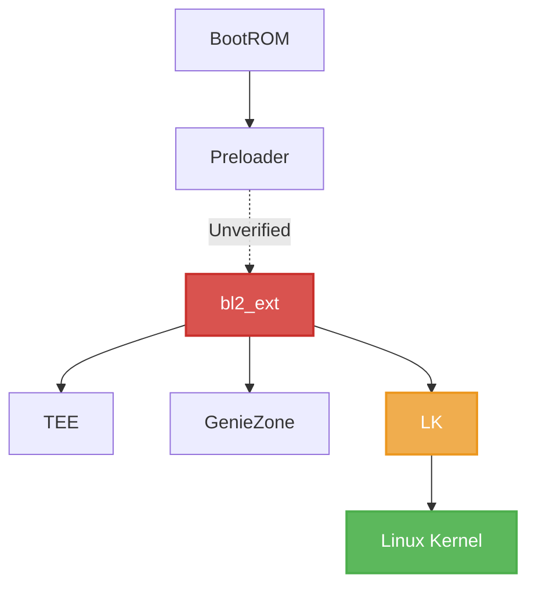

# 🐺 Fenrir

An LK patcher to bypass secure boot checks and force boot state to green on Dimensity devices.

[](LICENSE)
[](https://www.python.org/)

This is a PoC exploit for a vulnerability in the MediaTek Dimensity secure boot chain (`bl2_ext` EL3 takeover).

It abuses a logic flaw where MediaTek Preloader skips cryptographic verification of `bl2_ext` if the `seccfg` unlock state is set to unlocked.

The exploit achieves code execution at **EL3** and breaks the secure boot chain after Preloader execution.

> [!CAUTION]
> **I AM NOT RESPONSIBLE FOR BRICKED DEVICES.** This exploit can permanently destroy your phone if something goes wrong.

---

## 📖 Explanation

This exploit abuses a flaw in the MediaTek boot chain. When the bootloader is unlocked (`seccfg`), the Preloader skips verification of the `bl2_ext` partition, even though `bl2_ext` is responsible for verifying everything that comes after it.

### The issue is critical because:
1. **Preloader jumps directly into `bl2_ext` while still running at EL3** (highest privilege level in ARM64 Exception Levels).
2. **`bl2_ext` controls the transition to EL1** and the non-secure world.
3. **An unverified `bl2_ext` can load any subsequent images without checks.**

By patching `bl2_ext` to skip verification, the entire chain of trust collapses.



The actual exploit patches `sec_get_vfy_policy()` to always return 0, so an unverified `bl2_ext` running at EL3 happily loads unverified images for the rest of the boot chain.

In addition to patching `sec_get_vfy_policy()`, the PoC also spoofs `ro.boot.verifiedbootstate` to **`green`** and the device's lock state to `LKS_LOCK` (`ro.boot.flash.locked = 1`) so you can pass **Strong Play Integrity** checks anywhere while being unlocked.

---

## 🚀 Usage

### 1. Prerequisites & Dependencies
The injector is built on top of `liblk`, install it first:

```bash
pip install -r requirements.txt
```

Place your stock bootloader image in the `bin/` directory with your device codename (e.g., `bin/pacman.bin`, `bin/x6861.bin`, `bin/x6871.bin`).

### 2. Building the Exploit
Once you have your bootloader image ready, you can build the exploit using the build script:

#### Linux / macOS:
```bash
# Using default bootloader location (bin/[device].bin)
./build.sh X6861

# Using custom bootloader path
./build.sh X6861 /path/to/your/bootloader.bin
```

#### Windows:
```cmd
python build.py X6861
```

After building, you will see a new file named `lk.patched` in the root directory.

### 3. Flashing
Flash the patched bootloader image to both slots on your device:

```bash
fastboot flash lk_a lk.patched
fastboot flash lk_b lk.patched
fastboot reboot
```

Or run the automated flasher script:
```bash
python flash.py
```


---

## 📱 Supported Devices Status

The following devices are currently supported and tested:

| Device | Codename | Platform | Status |
| :--- | :---: | :---: | :---: |
| **Infinix GT 20 Pro** | **`X6871`** | **Dimensity 8200 (`mt6895`)** | **Supported 🟢** |
| **Infinix ZERO 40 5G** | **`X6861`** | **Dimensity 8200 (`mt6878`)** | **Supported 🟢** |
| Nothing Phone (2a) | `Pacman` | Dimensity 7200 Ultra | Supported 🟢 |
| Nothing Phone (2a) Plus | `PacmanPro` | Dimensity 7350 Pro | Supported 🟢 |
| CMF Phone 1 | `Tetris` | Dimensity 7300 | Supported 🟢 |
| Tecno Pova 4 | `LG7n` | Helio G99 | Supported 🟢 |
| Tecno Pova 4 Pro | `LG8n` | Helio G99 | Supported 🟢 |
| Tecno Pova 5 | `LH7n` | Helio G99 | Supported 🟢 |
| itel RS4 | `S666LN` | Helio G99 | Supported 🟢 |
| Redmi K70E / POCO X6 Pro 5G | `duchamp` | Dimensity 8300 Ultra | Supported 🟢 |
| Redmi Turbo 4 / POCO X7 Pro | `rodin` | Dimensity 8400 | Supported 🟢 |
| Redmi Turbo 5 Max / POCO X8 Pro Max | `dash` | Dimensity Platform | Supported 🟢 |
| Redmi Note 11T Pro / POCO X4 GT | `xaga` | Dimensity 8100 | Supported 🟢 |
| Xiaomi 12T | `plato` | Dimensity 8100 Ultra | Supported 🟢 |
| Lenovo IdeaTab Pro / Xiaoxin Pad Pro 12.7 | `peridotl` | Dimensity 8300 | Supported 🟢 |
| Zinwa Q25 | `Q25` | Dimensity Platform | Supported 🟢 |

---

## 📌 Finding Verification in `expdb`

Adding support for a new device is possible by examining an `expdb` dump and looking for the `img_auth_required` flag when the partition is being loaded:

```text
[PART] img_auth_required = 0
[PART] Image with header, name: bl2_ext, addr: FFFFFFFFh, mode: FFFFFFFFh, size:654944, magic:58881688h
[PART] part: lk_a img: bl2_ext cert vfy(0 ms)
```

---

## 📝 TODO
- [ ] Add proper porting guide for new devices
- [ ] Fix MMU crashes when modifying memory at runtime
- [ ] Figure out proper payload appending method

---

## 👥 Credits & Core Team

- **[@sheikhmehraann](https://github.com/sheikhmehraann)** — **Project Owner & Lead Developer**
  - Architecture porting & exploit integration for Infinix GT 20 Pro (`X6871`) & Infinix ZERO 40 5G (`X6861`).
  - Binary forensics, memory layout analysis, and 7-stage surgical patch engineering.
  - Windows flasher tooling, multi-device build pipeline maintainer, and release management.

- **[@R0rt1z2](https://github.com/R0rt1z2)** — Original Fenrir exploit framework author & `liblk` library creator.

- **[@ramabondanp](https://github.com/ramabondanp)** — Device testing, recovery packaging, guidance, and distribution.

---

## 📄 License

This project is licensed under the **GNU Affero General Public License v3.0 (AGPL-3.0)**.
